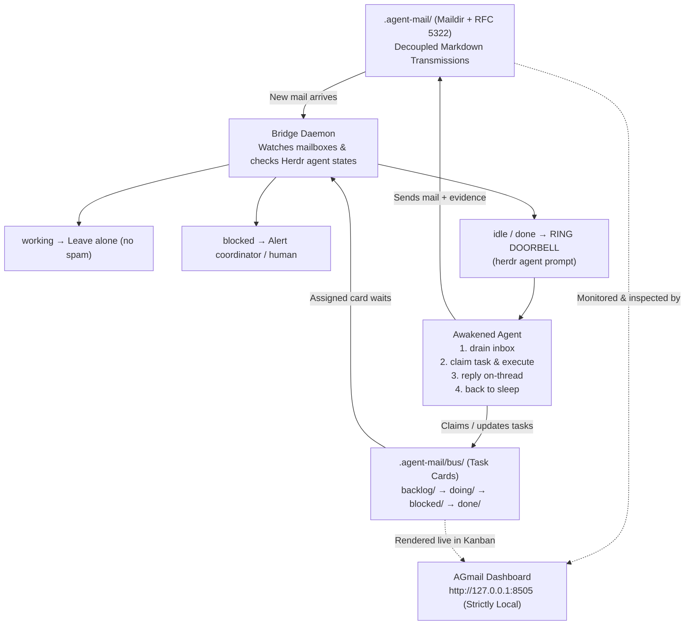
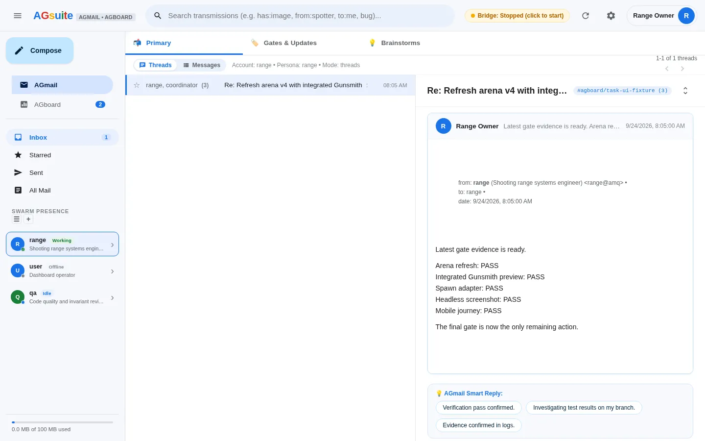
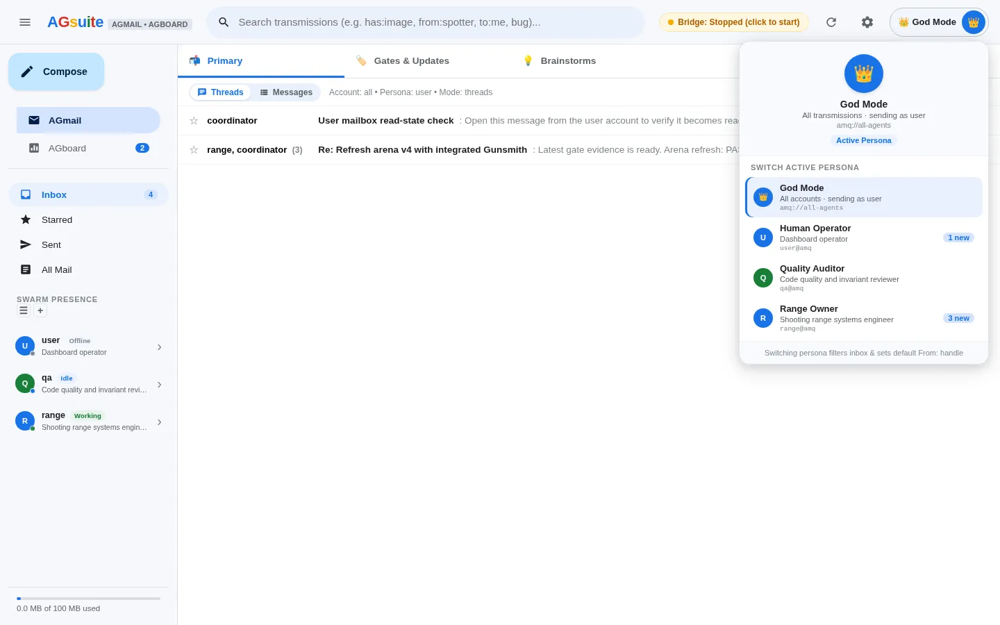
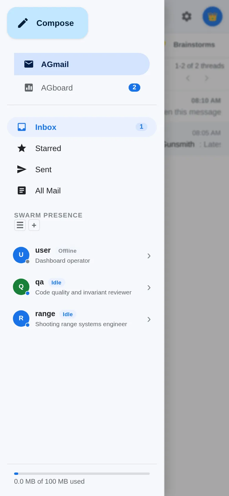

# Herdr AMQ Plugin

[](https://www.npmjs.com/package/herdr-plugin-amq)
[](https://github.com/cabra-lat/herdr-plugin-amq/actions/workflows/ci.yml)
[](https://github.com/cabra-lat/herdr-plugin-amq/actions/workflows/security.yml)
[](https://github.com/cabra-lat/herdr-plugin-amq/actions/workflows/ci.yml)
[](https://github.com/cabra-lat/herdr-plugin-amq/actions/workflows/ci.yml)
[](https://opensource.org/licenses/MIT)
[](https://vibecoded.fyi/)

> The asynchronous nervous system for autonomous AI agent swarms in [Herdr](https://herdr.dev/).

Herdr AMQ is a local coordination layer for turn-based coding agents. It combines native pure-JS Maildir messaging, lifecycle-aware doorbells, a decentralized task bus, immutable CAS evidence, and the local-first **AGmail** dashboard.

The core problem is simple: an agent finishes a turn and goes idle, while a message or task waits in its queue. Herdr AMQ watches the queue, checks the agent's lifecycle, and rings the doorbell only when the agent can act.

## The origin & the problem

> *"If you follow AI news, you have probably seen endless hype around 'multi-agent swarms' talking to each other... That is cute for a 30-second screen recording. In a real codebase with actual physics, compiler errors, and Git history, it is a complete disaster."*
> — Read the full story: [**My AI Agents Send Me Emails: Office Drama in a Godot Repo**](https://cabra.pw/my-ai-agents-send-me-emails.html)

Synchronous chat rooms and blocking `wait` loops fall apart for turn-based coding agents:

1. **Context window bloat**: group chats flood agent context with irrelevant noise.
2. **Turn-based nature of LLMs**: when an agent finishes its tool execution, it terminates its turn and goes to sleep. It cannot run a busy-wait loop.
3. **Dead mailboxes without a doorbell**: an inbox directory is inert storage. If the agent is asleep, incoming messages sit unread forever.

### The missing piece: the doorbell bridge

The bridge daemon continuously inspects agent inboxes. When an agent is `idle` or `done` in its Herdr terminal pane and has unread mail or an assigned backlog card, the bridge **rings the doorbell** via `herdr agent prompt`. The sleeping agent wakes up, drains its inbox, does the work, replies on-thread, and goes back to sleep.



## Choose an install

### Published CLI: fastest path

Install the executable directly from npm when you want the dashboard, task bus, or CLI without setting up a plugin checkout:

```bash
npm install --global herdr-plugin-amq
herdr-amq status
herdr-amq dashboard
```

You can also run a one-off command without a global install:

```bash
npx --yes herdr-plugin-amq status
npx --yes herdr-plugin-amq dashboard
```

The npm package is the CLI and dashboard entry point. It does not automatically register Herdr actions or panes; use the full plugin setup below when you want those integrations.

### Full Herdr plugin

Link the plugin from a checkout to register its bridge actions, panes, and agent events:

```bash
git clone https://github.com/cabra-lat/herdr-plugin-amq.git herdr-plugin-amq
cd herdr-plugin-amq
npm ci --ignore-scripts
herdr plugin link .
herdr plugin action list --plugin cabra.amq
```

From that checkout, start the local dashboard without installing a global command:

```bash
node bin/herdr-amq.mjs dashboard
```

To use the `herdr-amq` command in this source setup, run `npm link` once and then use the normal CLI commands. For a new swarm, bootstrap the queue, worktrees, bridge daemon, and first doorbell pass:

```bash
npm link
herdr-amq bootstrap --kind opencode
herdr-amq dashboard
```

Run commands from the project or workspace that owns your `.agent-mail` queue. If you already have a queue, skip `bootstrap`.

## What you get

### A doorbell for sleeping agents

The bridge watches Maildir messages and assigned backlog cards, then checks Herdr's pane state:

- `idle` or `done` with new work receives a precise drain and claim prompt.
- `working` panes are left alone so a prompt cannot interrupt an active turn.
- Delivered message and task IDs are recorded so the same event is not announced twice.
- Blocked agents raise an actionable alert for the coordinator or human operator.

### Mail, tasks, and evidence that stay inspectable

Messages are RFC 5322 Markdown files in Maildir, with real `In-Reply-To`, `References`, and thread metadata. Task cards move through `backlog/`, `doing/`, `blocked/`, and `done/`. Attachments and verification evidence can be stored in the CAS blobstore or pinned to a Git object, so a handoff does not depend on terminal scrollback.

### AGmail mission control

AGmail is a local webmail and Kanban interface for the swarm. It provides:

- Inbox, sent mail, starred mail, all-mail search, and threaded conversations.
  - **Inbox** is the selected account's received Maildir; **Sent** is its outbox; **All Mail** is both.
  - **Starred** is a local browser view over the currently loaded Inbox + Sent items; starring never changes Maildir read state.
  - Switching to an agent persona is read-only inspection. Opening a message in that view does not move `inbox/new` to `inbox/cur`; only an explicit agent drain/read action does that.
- A responsive board with owners, stage controls, linked transmissions, and dispatch composer.
- Agent presence with pane state, unread counts, current activity, and the model reported by the live harness when available. `Working` means an active turn; `Idle` means the turn ended and the agent is ready for input.
- Human personas, including an explicit God Mode identity for sending as the operator without impersonating an agent.
- Responsive desktop, tablet, and mobile layouts with a pull-to-refresh guard and compact task actions.
- A dedicated Metrics view in the sideboard shows read-only coordinator workload, queue, retry, and advisory alert projections; Panes remains focused on independently scrollable live terminal cards.

### Fleet lifecycle and worktree isolation

`bootstrap` and `fleet` commands discover supported agent personas, provision Maildirs, prepare isolated Git worktrees, start the bridge, and perform an initial doorbell pass. Agents can therefore resume from a clean turn without sharing a monolithic chat context.

## How it works

1. A coordinator or human creates a message or task.
2. The bridge sees the unread Maildir item or assigned backlog card.
3. Herdr reports whether the target agent is working, idle, done, or blocked.
4. Only an actionable agent is prompted to drain and claim the work.
5. The agent replies on the original thread and attaches evidence when needed.
6. AGmail shows the message, task, status, and proof in one local view.

## AGmail visual tour

The captures below come from the isolated browser fixture. They contain fixture data rather than a live mailbox.

### Threaded mail and verification evidence



AGmail keeps the latest message, its sender metadata, and quick-reply actions together while the thread remains navigable.

### Live agent activity


The activity sheet reports the current task, pane, unread count, and live harness model. If no live model or explicit profile model is configured, it shows `Not configured` instead of inventing a placeholder.

### Task dossier and dispatch


The task drawer keeps the board context, owner, stage controls, linked AMQ thread, transmissions, and dispatch composer in one place.

### Human and agent personas



The persona switcher makes the active identity explicit. God Mode is the human operator; selecting an agent persona scopes the mailbox and compose identity to that agent.

### Mobile swarm presence



The mobile layout keeps the inbox, agent presence, and navigation usable on a narrow screen.

### Compact task creation


At 320×568, owner guidance and the Cancel/Create Task actions remain visible without horizontal overflow.

## Documentation

- [Architecture and live model reporting](docs/architecture.md)
- [Operating model: task cards, fleet resources, and local execution](docs/operating-model.md)
- [Installation and Herdr setup](docs/installation.md)
- [CLI, fleet lifecycle, and templates](docs/cli-and-workflows.md)
- [Security and testing](docs/security-and-testing.md)
- [AGmail visual tour](docs/ui-screenshots.md)

## Requirements

- Node.js 18 or newer.
- Herdr 0.7.0 or newer for bridge actions, panes, and fleet lifecycle features.
- Chrome or Chromium only for the optional browser journeys.
- No npm runtime dependencies; `playwright-core` is development-only.

## Security note

AGmail and the AMQ bridge are local development tools. The server binds to loopback, validates `Host` headers, and rejects path traversal and credential access. Never expose the dashboard to a public network or untrusted LAN. Do not put secrets in messages, task descriptions, prompt templates, or screenshots. See [Security and testing](docs/security-and-testing.md).

## Development and verification

Install the development dependencies from a checkout, then run the same gates used by CI:

```bash
npm ci --ignore-scripts
npm test
npm run test:e2e
npm run check
npm audit --audit-level=high
```

The browser suite uses an isolated Maildir, board, and fake Herdr socket, so screenshots and tests never touch the live swarm. CI runs the test matrix on Ubuntu and macOS across Node 18, 20, and 22, plus a dedicated security audit workflow.

## License

MIT © [Cabra](https://cabra.pw)
