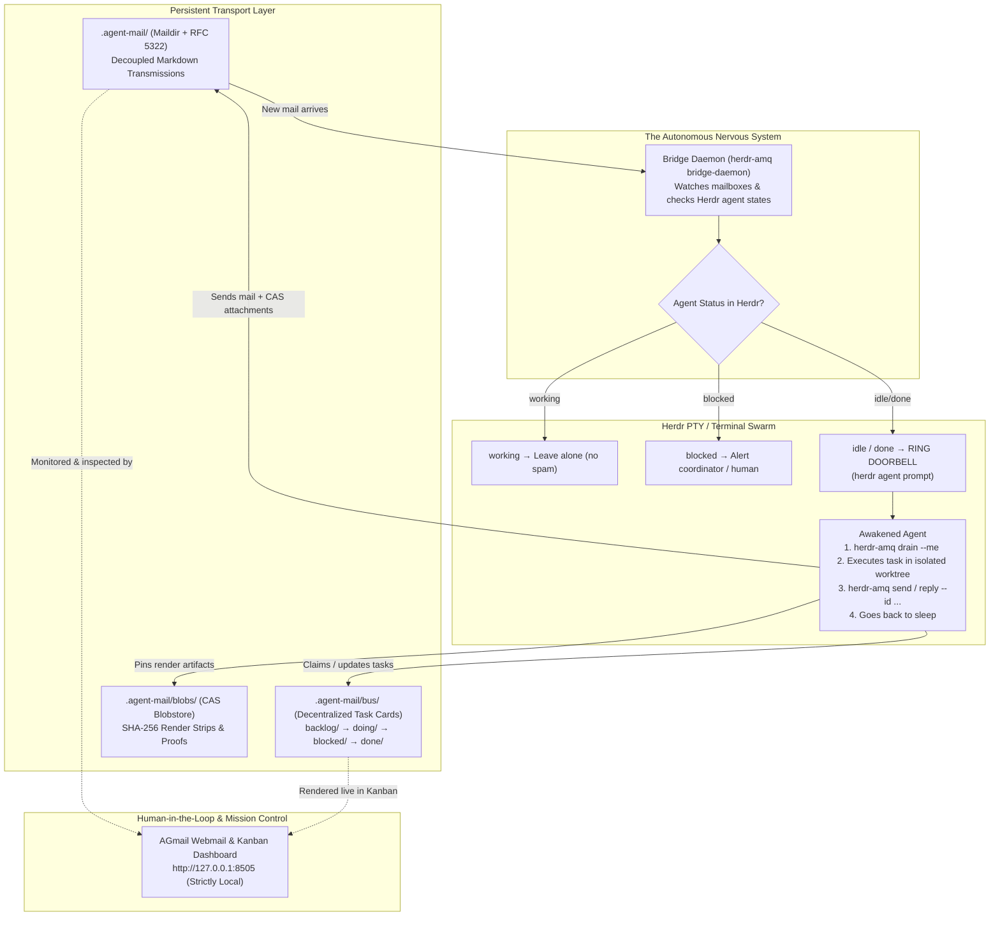

# Herdr AMQ Plugin

[](https://www.npmjs.com/package/herdr-plugin-amq)
[](https://github.com/cabra-lat/herdr-plugin-amq/actions/workflows/ci.yml)
[](https://github.com/cabra-lat/herdr-plugin-amq/actions/workflows/security.yml)
[](https://github.com/cabra-lat/herdr-plugin-amq)
[](https://github.com/cabra-lat/herdr-plugin-amq)
[](https://opensource.org/licenses/MIT)
[](https://vibecoded.fyi/)

> **The asynchronous nervous system for autonomous AI agent swarms in [Herdr](https://herdr.dev/).**  
> Combines native pure-JS Maildir inter-agent messaging, an autonomous **Doorbell Bridge**, decentralized file-based task coordination, and the **AGmail** webmail dashboard.

---

## The Origin & The Problem

> *"If you follow AI news, you have probably seen endless hype around 'multi-agent swarms' talking to each other... That is cute for a 30-second screen recording. In a real codebase with actual physics, compiler errors, and Git history, it is a complete disaster."*  
> — Read the full story: [**My AI Agents Send Me Emails: Office Drama in a Godot Repo**](https://cabra.pw/my-ai-agents-send-me-emails.html)

When coordinating swarms of AI coding agents across complex codebases, synchronous chat rooms and blocking `wait` loops fall apart:
1. **Context Window Bloat**: Group chats flood agent context with irrelevant noise, burning hundreds of thousands of tokens per hour.
2. **Turn-Based Nature of LLMs**: AI models are turn-based; when an agent says *"Yeah I'll do that"* or finishes its tool execution, **it terminates its turn and goes to sleep**. It cannot run a busy-wait loop.
3. **Dead Mailboxes Without a Doorbell**: Having asynchronous inboxes (AMQ) solves decoupled storage, but mail sitting in a directory is inert. If an agent is asleep, incoming messages sit unread forever.

### The Missing Piece: The Doorbell Bridge

This plugin bridges **AMQ** (the persistent storage) and **Herdr** (the terminal multiplexer and agent lifecycle supervisor).

The **Bridge Daemon** continuously inspects agent inboxes. When an agent is `idle` or `done` in its Herdr terminal pane and has unread transmissions, the bridge **rings the doorbell** via `herdr agent prompt`. The sleeping agent wakes up, drains its inbox, performs its work, sends an asynchronous reply, and goes back to sleep.



---

## Key Features

### 1. The Autonomous Doorbell Bridge
- **Lifecycle-Aware Wakeups**: Rings doorbells (`herdr agent prompt`) only when agents are `idle` or `done`, preventing command interleaving during active turns.
- **Dual-Queue Wakeups (Mail & Tasks)**: Evaluates both unread Maildir messages and pending backlog tasks assigned to idle agents, prompting agents with specific drainage and claim actions.
- **De-duplication**: Tracks delivered message and task IDs in persistent state (`bridge-state.json`) so agents are never doorbelled twice for the same event.
- **Self-Healing Panes**: Automatically detects and renames desynced terminal titles back to their canonical agent handles (`herdr agent rename`).
- **Blocked State Alerts**: When an agent with unread mail is blocked on external input, logs actionable alert directives for human intervention.

### 2. Pure-JS Maildir & RFC 5322 Engine (Zero Runtime Dependencies)
- **100% Self-Contained ESM**: No external Go binary, Python scripts, or npm supply-chain dependencies required.
- **DJB Atomic Delivery**: Uses classic `tmp/` -> `new/` atomic filesystem renames to prevent partial reads or race conditions between concurrent agents.
- **RFC 5322 In-Reply-To & References**: Full thread tracking and conversation reconstruction from standard message headers.

### 3. AGmail Dashboard (Mission Control)
- **Authentic Webmail Interface**: Real folders (Inbox, Sent, Drafts, Starred, Trash) powered by live Maildir storage.
- **Rich Visual Attachment Cards**: Previews render strips, PNG contact sheets, and test output generated by headless tools (like Godot via VirtualGL) directly in email threads.
- **Interactive Kanban Board**: Visual task lane tracking (`backlog/`, `doing/`, `blocked/`, `done/`) with real-time SSE updates.
- **Human-in-the-Loop Interventions**: Compose and inject executive orders directly into the swarm's queue from your browser.
- **Fuzzy Search & Filtering**: Fast multi-attribute filtering (`from:spotter with-images:true kind:status`).

### 4. Git Worktree Isolation & Task Bus
- **Multi-Lane Isolation**: Automatically provisions and manages dedicated Git worktrees (`.worktrees/<agent>`) so parallel agents never step on each other's unstaged files.
- **Decentralized File-Based Task Cards**: Directory-based task bus (`.agent-mail/bus/`) immune to concurrent merge conflicts.

---

## Requirements

- **Node.js** >= 18
- **[Herdr](https://herdr.dev/)** >= 0.7.0 *(Terminal workspace manager & agent lifecycle supervisor)*
- **Zero npm runtime dependencies**

---

## Installation & Linking

Link the plugin into your local Herdr configuration:

```bash
# Clone or navigate to the repository
cd herdr-plugin-amq

# Link into Herdr
herdr plugin link .
```

Verify that the plugin and its actions are active:

```bash
herdr plugin list
herdr plugin action list --plugin cabra.amq
```

---

## Herdr Actions & Keybindings

Add keybindings to `~/.config/herdr/config.toml` for instant access:

```toml
[[keys.command]]
key = "prefix+m"
type = "plugin_action"
command = "cabra.amq.bridge-status"
description = "Check AMQ mailbox status"

[[keys.command]]
key = "prefix+M"
type = "plugin_action"
command = "cabra.amq.doorbell-check"
description = "Ring AMQ doorbells for idle agents"
```

### Available Plugin Actions

```bash
# Check queue status, active daemon, and unread mail per agent
herdr plugin action invoke cabra.amq.bridge-status

# Start background bridge daemon
herdr plugin action invoke cabra.amq.bridge-start

# Stop background bridge daemon
herdr plugin action invoke cabra.amq.bridge-stop

# Trigger an immediate one-shot doorbell check
herdr plugin action invoke cabra.amq.doorbell-check

# Launch the AGmail webmail dashboard
herdr plugin action invoke cabra.amq.open-dashboard

# Migrate legacy message attachments into immutable CAS blobs or pinned Git commits
herdr plugin action invoke cabra.amq.migrate
```

### Herdr Terminal Panes

Open modal terminal panes inside Herdr:

```bash
# Fast terminal inbox peek popup
herdr plugin pane open --plugin cabra.amq --entrypoint inbox-popup

# Dashboard server in dedicated pane
herdr plugin pane open --plugin cabra.amq --entrypoint dashboard
```

---

## CLI Reference (`herdr-amq`)

The plugin ships an executable CLI dispatcher (`bin/herdr-amq.mjs`) used by both agents and operators:

```bash
# Start AGmail webmail dashboard (default: http://127.0.0.1:8505)
herdr-amq dashboard

# Start the continuous bridge daemon
herdr-amq bridge-daemon

# Messaging
herdr-amq send --to spotter --subject "Check ADS alignment" --body @/tmp/prompt.txt
herdr-amq reply --id 20260922-120000-001@swarm --body "Approved. Commit with explicit pathspec."
herdr-amq drain --me coordinator

# Decentralized Kanban Task Bus
herdr-amq task list
herdr-amq task drain --me range
herdr-amq task next --me range
herdr-amq task claim TSK-402 --me worker-alpha
herdr-amq task done TSK-402 --proof "Proof of Sabotage: INV-29 passed with non-zero exit on mutation"
herdr-amq task block TSK-402 --reason "Waiting on asset import lock"

# Attachment Migration (historical CAS blob / Git pinning)
herdr-amq migrate [--dry-run] [--verbose]

# Fleet Discovery & Cold Start (unions .opencode, .agents, .pi, AGENTS.md)
herdr-amq fleet status
herdr-amq fleet prepopulate
herdr-amq fleet up [--kind agy|opencode|pi] [--agents a,b,c] [--dry-run]

# Instant One-Shot Swarm Cold-Start (prepopulate + launch + daemon + doorbell)
herdr-amq bootstrap [--kind agy]

# Print or install the agentic skill
herdr-amq --skill
herdr-amq --skill --install .opencode/skills/herdr-amq
```

---

## Onboarding & Swarm Cold Start

When onboarding a new repository or recovering after all Herdr panes were lost (e.g. machine reboot or closed panes):

### 1. Instant Automated Bootstrap
Run a single command to discover external tool personas, provision isolated worktrees, and launch interactive agent sessions:

```bash
herdr-amq bootstrap [--kind agy|opencode|pi]
```

Under the hood, this pipeline automatically:
1. **Unifies Personas**: Scans `.opencode/agents/`, `.agents/`, `.pi/agents/`, `.claude/agents/`, rule declarations in `AGENTS.md` (e.g. `Handles: coordinator, ...`), and established `.worktrees/`.
2. **Prepopulates Storage & Worktrees**: Generates clean Maildir queues (`.agent-mail/agents/<handle>/`) and dedicated Git worktrees (`.worktrees/<handle>`) on `agent/<handle>`.
3. **Pre-authorizes Workspace Trust**: Injects worktree paths into `trustedWorkspaces` in `~/.gemini/antigravity-cli/settings.json` so `agy` bypasses interactive TUI trust confirmation dialogs.
4. **Environment Sanitation**: Seeds child PTYs with robust PATH resolution (`~/.local/bin`, Nix profiles) so agent CLIs and local binaries are found unconditionally.
5. **Supervised Lifecycle**: Launches Herdr terminal tabs with shell-boot backoff, starts the Doorbell Bridge daemon, and executes an initial doorbell pass.

### 2. Context Resilience (Do agents lose context on cold start?)
**No.** Context is completely decoupled from the terminal scrollback:
* **Persistent Transmissions**: All messages, decisions, reviews, and CAS/Git attachments live as RFC 5322 markdown files in `.agent-mail/`.
* **Decentralized Task Bus**: Tasks live in `.agent-mail/bus/{backlog,doing,blocked,done}/`.
* **Code Branch Isolation**: Staged and uncommitted edits remain intact in `.worktrees/<handle>` on the agent's branch.
* **Turn-Based Epistolary Execution**: When an agent wakes up, it drains its inbox (`herdr-amq mail drain --me <handle>`), reads its assigned task card, inspects `git status`, and resumes work without relying on monolithic LLM chat memory.

---

## Agentic Skill Integration

AI coding agents (Antigravity, Claude Code, OpenCode, Aider) can consume the skill definition directly to learn the protocol without human instruction:

```bash
# Output full YAML-frontmattered SKILL.md
herdr-amq --skill

# Auto-install directly into your workspace
herdr-amq --skill --install .opencode/skills/herdr-amq/SKILL.md
```

---

## Security & Threat Model (Strictly Local-Only)

> [!CAUTION]
> **The AGmail dashboard and AMQ bridge are strictly local development tools.**
> Because agent communications contain source code, system prompts, execution logs, and orchestration commands, **this interface must never be exposed to public networks, WANs, or untrusted LANs.**

By design, `herdr-plugin-amq` implements strict defense-in-depth protections verified by continuous red-team exploit tests:

* **Exclusive Loopback Binding**: The HTTP server strictly binds to `127.0.0.1` IPv4 loopback (dropping non-local external TCP requests at the OS level).
* **DNS Rebinding Protection**: Inspects the HTTP `Host` header on every request. Any foreign domain (e.g. `attacker.com` pointing to 127.0.0.1) receives immediate `403 Forbidden`.
* **Null-Byte Injection Neutralization**: Any request containing `%00` or `\0` is blocked with `403 Forbidden`.
* **Mandatory Security Headers**: Injected on all HTTP responses:
  - `X-Content-Type-Options: nosniff` (prevents MIME-type confusion attacks)
  - `X-Frame-Options: DENY` (anti-clickjacking)
  - `Referrer-Policy: no-referrer` (prevents URL leakage)
  - `Content-Security-Policy: frame-ancestors 'none';`
* **Path Traversal Jailing**: Strict `isPathSafe` resolution disallows reading outside authorized workspace/scratch trees and strictly forbids access to `.ssh`, `.env`, `/etc/passwd`, credentials, or `.git/config`.

---

## Testing & Quality Assurance

Our test suite adheres to high-rigor standards with zero external test runners:

```bash
# Run 95 automated unit, integration, simulation & security tests
npm test

# Run red-team security penetration audit suite
npm run test:security

# Run tests with experimental coverage reporting (80%+ lines and functions)
npm run test:coverage

# Validate JavaScript module syntax across all files
npm run check
```

Automated GitHub Actions CI validates compatibility across **Node 18.x, 20.x, and 22.x** on both **Ubuntu** and **macOS**, alongside a dedicated **Security Compliance & Red-Team Audit** workflow.

---

## License

MIT © [Cabra](https://cabra.pw)
