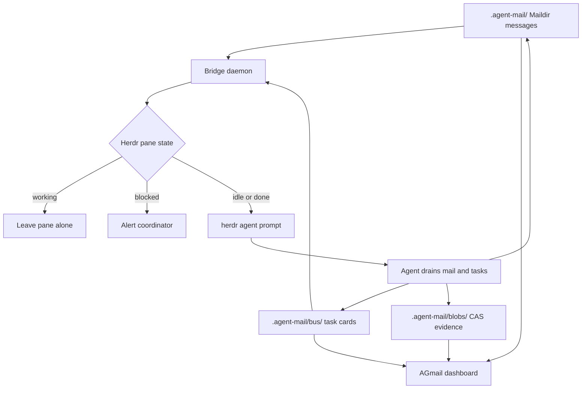

# Architecture

Herdr AMQ is the coordination layer between turn-based coding agents and a human operator. It keeps transport, task state, and oversight separate so a sleeping agent can be woken without sharing a chat context.

## Why the bridge exists

Synchronous group chat does not fit autonomous coding sessions:

1. Group messages consume context with irrelevant activity.
2. An agent turn ends after a response or tool sequence; it cannot busy-wait for the next instruction.
3. A Maildir inbox preserves messages, but an idle agent needs a lifecycle-aware wakeup.

AMQ provides persistent Maildir messages, a file-based task bus, and immutable CAS attachments. The bridge watches Herdr panes and prompts only agents that are `idle` or `done`. Working panes are left alone; blocked panes raise an actionable alert.

Herdr lifecycle semantics are explicit: `working` is an active turn, while `idle` and `done` are terminal turn states where a new prompt can be delivered. AGmail coalesces rapid status events before rendering so transient output or stale snapshots do not make the indicator flicker.

## Data flow

## Components

| Component | Responsibility |
|---|---|
| `src/bridge.mjs` | Lifecycle-aware Maildir/task doorbells, deduplication, blocked alerts |
| `src/herdr.mjs` | Herdr socket snapshot/events and live pane activity |
| `src/runtime-models.mjs` | Best-effort live model lookup from harness metadata and OpenCode sessions |
| `src/store.mjs` | Maildir parsing, profiles, attachments, and agent discovery |
| `src/board.mjs` | Backlog, claimed, blocked, and done task cards |
| `src/server.mjs` | Loopback API, SSE updates, and AGmail static assets |
| `src/web/` | Responsive webmail, activity sheet, and Kanban UI |

## Live model reporting

The profile model is optional configuration metadata, not proof of the model currently selected by a running harness. When Herdr exposes model fields, AGmail uses them first. For OpenCode panes, the Herdr `agent_session.value` is resolved against the local OpenCode session database and rendered as `provider/model (variant)`. The API returns `modelSource` when a model is known; when neither live nor explicit profile metadata is available, the model remains `null` and the UI shows `Not configured`.

The resolver is best-effort: unavailable Herdr/OpenCode data leaves the configured profile visible rather than inventing a model.
