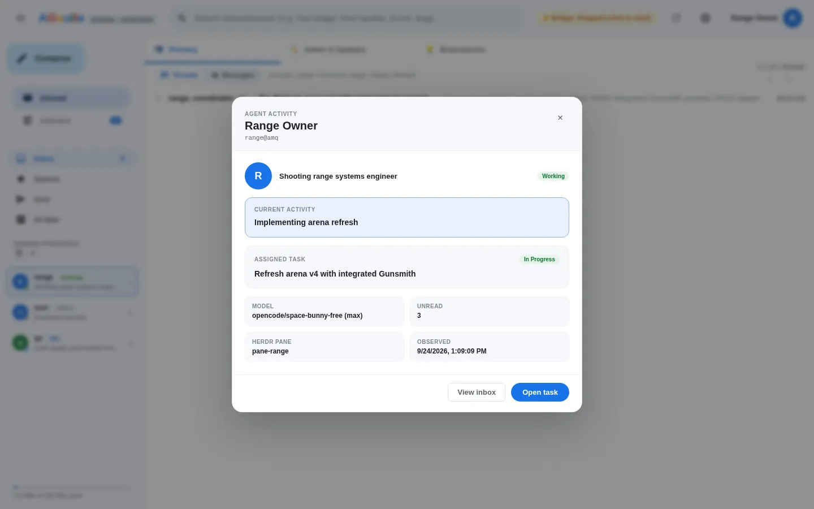
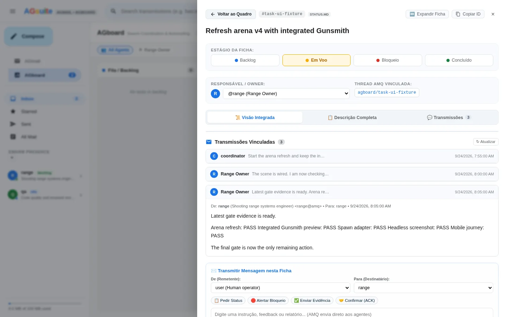
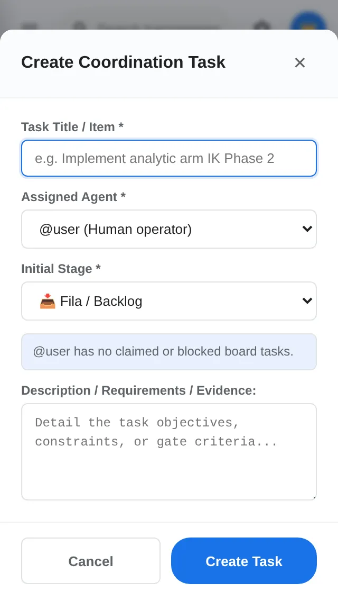

# AGmail visual tour

These captures come from the isolated browser fixture. They contain no live mailbox data and are checked by the desktop/mobile journey suite.

## Agent activity

The activity sheet combines the live Herdr state, assigned task, unread count, pane ID, and the model reported by the running harness. The model is sourced from Herdr/OpenCode session metadata when available, rather than blindly displaying the profile fallback.

## Task dossier

The task drawer keeps the stage controls, owner, linked AMQ thread, transmissions, and dispatch composer together while preserving the board context behind the drawer.

## Compact New Task flow

At 320×568, the owner tip and sticky action row remain visible. The form warns before assigning a card to an owner with claimed or blocked work.

